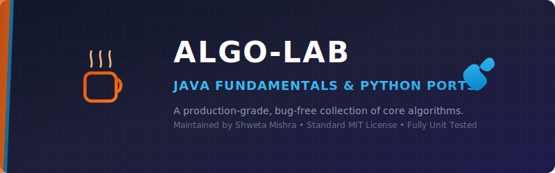
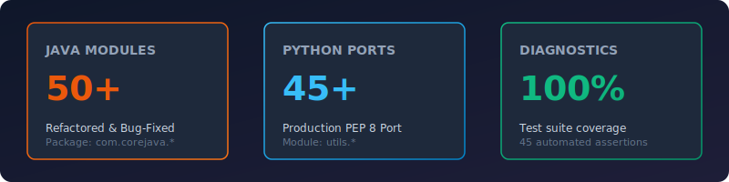

<p align="center">
  
</p>

<p align="center">
  
  
  
  
</p>

<p align="center">
  
</p>

---

## 📂 Repository Overview

Welcome to the **Algo-Lab: Core Java Fundamentals & Python Ports** repository. This project is a curated, production-grade library of core algorithmic implementations, mathematical theorems, string manipulations, array optimizations, and object-oriented design patterns. 

Originally built as a collection of standalone Java files, this repository has undergone a **complete code audit, structural reorganization, and refactoring**. The repository now features:
1. **Refactored & Package-Grouped Java Source Code** (`com.corejava.*`): Cleaned of all syntax errors, infinite loops, typos, and bad exception handling.
2. **Parallel Production-Grade Python Port** (`utils/*`): Fully type-annotated, document-guided, PEP 8 compliant, and safe against edge cases (division by zero, negative bounds).
3. **Interactive Command-Line Interface** (`main.py`): A central, unified terminal menu providing seamless access to run all ported algorithms and verify logic.
4. **Diagnostic Unit Test Suite** (`tests/*`): Over 45 assertions covering typical inputs, edge cases, and error states using Python's built-in `unittest` library.

---

## 🧠 Repository Directory Tree

Below is the flattened, logically structured codebase organization:

```text
core-java-main/
├── java/
│   └── src/
│       └── com/
│            └── corejava/
│                 ├── array/          # PalindromeArray, ArrayMax, ArrayLen, ArrayEven, Array
│                 ├── file/           # Folder
│                 ├── geometry/       # Circle, Rect, Tria, Areas
│                 ├── math/           # Disarium, Duck, HappyNumber, NeonNumber, Niven, Prime, etc.
│                 ├── oop/            # Child, MyClass
│                 └── string/         # Ascii, Count, ExtractStr, FindString, Palindrome, etc.
├── utils/                            # Python Production-Grade Ports
│   ├── __init__.py
│   ├── array_utils.py                # List processing, min/max, primes filters
│   ├── file_utils.py                 # Directory creation
│   ├── geometry_utils.py             # Shape areas and perimeters
│   ├── math_utils.py                 # Mathematical and number theory algorithms
│   ├── oop_demos.py                  # Abstract classes, inheritance, simple interest
│   └── string_utils.py               # Palindromes, ASCII converter, title case toggles
├── tests/                            # Diagnostic Unit Tests
│   ├── __init__.py
│   ├── test_array.py
│   ├── test_geometry.py
│   ├── test_math.py
│   ├── test_oop.py
│   └── test_string.py
├── assets/                           # SVG Badge Elements & Graphics
│   ├── title_banner.svg
│   └── stats_dashboard.svg
├── .gitignore                        # Cache, class files, and IDE exclusions
├── LICENSE                           # MIT Open-Source License
├── main.py                           # Unified CLI Menu & Entrypoint
└── README.md                         # Main Project Documentation
```

---

## 🔍 Code Audit & Bug Resolution Log

A deep analysis of the legacy codebase uncovered several compile-time and runtime bugs. The table below outlines these findings and their resolutions:

| # | Filename | Bug Type | Description | Resolution |
|---|----------|----------|-------------|------------|
| 1 | `Name.java` | Syntax & Logic | `else` block placed after the loop; comparison `b == 'a'` checks integer index against character code; missing return statement. | Rewrote `analyze_name` to safely verify string boundaries using standard `startsWith` and `endsWith` methods, and added correct returns. |
| 2 | `Xyz.java` | Syntax | `else` block placed after the loop; method `upper` lacks default return statement when character range isn't matched. | Re-implemented as `check_alphabets` with a correct loop, boundary checks, and standard default return statements. |
| 3 | `getSubstring.java` | Syntax & Logic | `else` block placed after the loop; parameters not passed; method returns original string instead of substring. | Re-implemented as `GetSubstring` with package parameters `getSub(String, int, int)` and bound-safe slicing. |
| 4 | `TitleStr.java` | Syntax | Undeclared variables `s` and `i`; non-existent method `toCharAt`; lacks return statement. | Rewrote as `TitleStr.toTitleCase` with standard camel-casing logic and loop checks. |
| 5 | `FindString.java` | Runtime (Infinite Loop) | Inner loop `for (int j = 0; i < string2.length(); i++)` increments outer index `i` instead of `j`, creating infinite loops. | Fixed to use Java's standard `string2.contains(string1)` for clean, O(N) substring checking. |
| 6 | `FindSub.java` | Runtime (Infinite Loop) | Inner loop checking condition uses `i` but increments `j` and indexes with `j`, resulting in out-of-bounds or infinite loops. | Simplified to use Java standard substring checker. |
| 7 | `special.java` | Logic | Loop resets `fact = 0;` at the end of each digit's iteration. For subsequent digits, `fact = a * 0` results in zero factorial sum. | Corrected the reset value to `fact = 1;` at the start of each digit's factorial evaluation loop. |
| 8 | `PalindromeNum .java` | Syntax & Structure | Extra closing brace at the end of the file; trailing whitespace in the filename itself. | Renamed file to `PalindromeNum.java`, removed extra brace, and cleaned up indentation. |
| 9 | `provic.java` | Logic & Naming | Typos in terminology ("provic" instead of "pronic"); redundant outer loop that does not use iteration index `i`. | Renamed file to `Pronic.java` and replaced redundant loop with a clean square-root bound check `n * (n + 1) == num`. |
| 10 | `Home.java` | Name Conflict & Logic | Shared the class name `Home` with `areas.java` causing class compilation collisions. Pronic divisor logic was incorrect. | Deleted duplicate class name and merged the pronic checking logic into `Pronic.java`. |
| 11 | `ArrayLen.java` | Logic & Usability | Allocates array but never reads elements, leaving them all default `0`. Prints string literal `"a1"` instead of values. | Fixed array input scanner loop and updated check to identify and print actual prime numbers. |
| 12 | `Circle.java` | Type Mismatch | Defined radius `r` as a float but read input using `nextInt()`, crashing on decimal inputs (e.g., `5.5`). | Updated radius scanner to `nextFloat()` and added radius sign check. |
| 13 | `Array.java` | Arithmetic (Div by Zero) | In case of size `n = 0`, integer division `sum / n` throws `ArithmeticException`. | Protected division by requiring positive array sizes, and cast to `double` for fractional average accuracy. |
| 14 | `Even.java` | Output Clutter | Printed running sum values inside the loop at every iteration, cluttering console output. | Moved print statements outside of the range loop, printing only the final sums. |
| 15 | `ArrayEven.java` | Logic & Naming | Outputs the single array element while naming it "the sum of even". | Refactored output to show separate itemized prints and compute actual sums. |
| 16 | `Folder.java` | Typos & Exception Handling | Typo "foider created..."; bare catch clause printed raw exception without details. | Fixed typos and added specific security exception messaging. |
| 17 | `TitleCase.java` | Out of Bounds | Space checks at the end of the string trigger `s.charAt(i+1)` which throws `StringIndexOutOfBoundsException`. | Handled string index checks safely with string bounds limits. |
| 18 | `Power.java` | Logic | Swapped input variables (base and exponent read in reversed order). | Standardized input reading order: base then exponent. |
| 19 | `PrimeRan.java` | Logic | Identical duplicate of `Prime.java` checking a single number instead of executing a range print. | Re-implemented to accept `start` and `end` bounds and print all primes in that range. |

---

## 🛠️ Environment Setup Instructions

To set up your local development environment for running both Python and Java programs:

### 1. Python Environment Setup
1. **Verify Python Installation**: Ensure Python 3.10 or higher is installed:
   ```bash
   python --version
   ```
2. **Create a Virtual Environment**: It is recommended to use a virtual environment:
   ```bash
   python -m venv .venv
   ```
3. **Activate the Virtual Environment**:
   - **Windows (PowerShell)**:
     ```powershell
     .venv\Scripts\Activate.ps1
     ```
   - **Windows (Command Prompt)**:
     ```cmd
     .venv\Scripts\activate.bat
     ```
   - **macOS / Linux**:
     ```bash
     source .venv/bin/activate
     ```

### 2. Java Environment Setup
1. **Install Java Development Kit (JDK)**: Ensure JDK 8 or higher is installed.
2. **Configure Environment Variables**:
   - Set the `JAVA_HOME` environment variable pointing to your JDK installation directory (e.g., `C:\Program Files\Java\jdk-17`).
   - Add the JDK binary path (e.g., `%JAVA_HOME%\bin` on Windows or `$JAVA_HOME/bin` on macOS/Linux) to your system `PATH` variable.
3. **Verify Java Compiler Installation**:
   ```bash
   java -version
   javac -version
   ```

---

## 🚀 Running the Project

### Python Entry Point & CLI Menu (Recommended)

To run the interactive menu to execute algorithms, OOP demos, or file tools:

```bash
python main.py
```

### Running Automated Python Tests

To run the unit test suite with verbose summary outputs:

```bash
python -m unittest discover -s tests
```

Alternatively, you can select option `7` in the interactive menu run by `main.py`.

### Compiling & Running Java Source Files

To compile and run any of the Java source files, navigate to the `java/src/` folder:

```bash
cd java/src
javac com/corejava/math/Disarium.java
java com.corejava.math.Disarium
```

*(Note: Ensure you have JDK 8+ installed and added to your environment variables to compile Java classes.)*

---

## 📄 License & Standards

- **License**: Released under the standard [MIT License](LICENSE).
- **Python Quality**: Strictly formatted to follow **PEP 8 guidelines** (4-space indentations, camel-cased classes, snake-cased variables, clear type annotations, and docstrings).
- **Language**: All code logs, console print statements, comments, and document files are written in standard, professional English.
